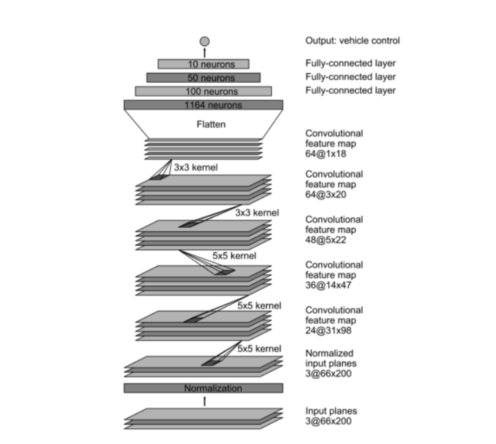

# **Behavioral Cloning** 

### 

---

**Behavioral Cloning Project**

The goals / steps of this project are the following:
* Use the simulator to collect data of good driving behavior
* Build, a convolution neural network in Keras that predicts steering angles from images
* Train and validate the model with a training and validation set
* Test that the model successfully drives around track one without leaving the road
* Summarize the results with a written report

Link of video https://www.youtube.com/watch?v=SGuKR1SK_Lo

Link to download Model https://drive.google.com/file/d/1yPSbSIGSHERkQnHLFm2OEYyDVTmoHSQl/view?usp=sharing

## Rubric Points
### 

---
### Files Submitted & Code Quality

#### 1. Submission includes all required files and can be used to run the simulator in autonomous mode

My project includes the following files:
* model.py containing the script to create and train the model
* drive.py for driving the car in autonomous mode
* model.h5 containing a trained convolution neural network 
* writeup_report.pdf summarizing the results

#### 2. Submission includes functional code
Using the Udacity provided simulator and my drive.py file, the car can be driven autonomously around the track by executing 
```sh
python drive.py model.h5
```

#### 3. Submission code is usable and readable

The model.py and Behavioral_Clonning.ipynb file contains the code for training and saving the convolution neural network. The file shows the pipeline I used for training and validating the model, and it contains comments to explain how the code works.

### Model Architecture and Training Strategy

The first step was to use  NVIDIA autonomous group convolution neural network model. The data was split into a training and training set. To combat the overfitting,  the model to includes a drop layer .  The last step was to conduct the simulator to determine how well the car was driving about track one.  


| Layer           | Output Shape  | Param  | Stride |
| --------------- | ------------- | ------ | ------ |
| Input           | 160 x 320 x 3 | 0      | -      |
| Cropping        | 95 x 320 x 3  | 0      | -      |
| Resizing        | 66 x 200 x 3  | 0      | -      |
| Normalization   | 66 x 200 x 3  | 0      | -      |
| Convolution 5x5 | 31 x 98 x 24  | 1824   | (2,2)  |
| ReLU            | 31 x 98 x 24  | 0      | -      |
| Convolution 5x5 | 14 x 47 x 36  | 21636  | (2,2)  |
| ReLU            | 14 x 47 x 36  | 0      | -      |
| Convolution 5x5 | 5 x 22 x 48   | 43248  | (2,2)  |
| ReLU            | 5 x 22 x 48   | 0      | -      |
| Convolution 3x3 | 3 x 20 x 64   | 27712  | -      |
| ReLU            | 3 x 20 x 64   | 0      | -      |
| Convolution 3x3 | 1 x 18 x 64   | 36928  | -      |
| ReLU            | 1 x 18 x 64   | 0      | -      |
| Flatten         | 1 x 1 x 1152  | 0      | -      |
| Fully Connected | 1 x 1 x 100   | 115300 | -      |
| Dropout         |               | 0.2    |        |
| Fully Connected | 1 x 1 x 50    | 5050   | -      |
| Fully Connected | 1 x 1 x 10    | 510    | -      |
| Fully Connected | 1 x 1 x 1     | 11     | -      |


Model parameter tuning

 No. of epochs = 400 with a  Early Stop callback with patience of 1 

Learning rate = 0.001 

Generator batch size = 5

 Optimizer = Adam 



#### 2. Attempts to reduce overfitting in the model

The model contains one dropout layers in order to reduce overfitting.  The model was trained and validated on different data sets to ensure that the model was not overfitting . The model was tested by running it through the simulator and ensuring that the vehicle could stay on the track.

#### 3. Model parameter tuning

The model used an adam optimizer, so the learning rate was not tuned manually 

#### 4. Appropriate training data

Training data was chosen to keep the vehicle driving on the road. I used a combination of center lane driving, recovering from the left and right sides of the road . For details about how I created the training data, see the next section. 

### Model Architecture and Training Strategy

#### 1. Solution Design Approach

The overall strategy for deriving a model architecture was to use NVidia model. I thought this model might be appropriate because is one of most use model to autonomous car. In order to gauge how well the model was working, I split my image and steering angle data into a training and validation set. I found that my first model had a low mean squared error on the training set but a high mean squared error on the validation set. This implied that the model was overfitting. 

To combat the overfitting, I modified the model so I add a Dropout layer and use Data Augmentation to blur,alter bright and shift the image. The final step was to run the simulator to see how well the car was driving around track one. There were a few spots where the vehicle fell off the track. to improve the driving behavior in these cases, I record more sample in these spots.

At the end of the process, the vehicle is able to drive autonomously around the track without leaving the road.


#### 3. Creation of the Training Set & Training Process

To capture good driving behavior, I first recorded 10 laps on track one using center lane driving and use Data Augmentation.


I use o a for structure to to train the model many times

``for i in range(0,1000):`

`gc.collect()`    

    df=df.sample(frac=1)
    
    newdf=pd.concat([df[df['steering']==0][:int(size)],df[(df['steering']>0) & (df['steering']<0.2)],df[(df['steering']<0) & (df['steering']>-0.2)][:int(size)],df[ (df['steering']<-0.2)][:int(size)],df[ (df['steering']>0.2)]],axis=0)
    
    newdf=newdf.sample(frac=1)
    
    from sklearn.model_selection import train_test_split
    train_samples, validation_samples = train_test_split(newdf, test_size=0.2)


    # Set our batch size
    batch_size=2
    
    # compile and train the model using the generator function
    train_generator = generator(train_samples, batch_size=batch_size)
    validation_generator = generator(validation_samples, batch_size=batch_size)


    model.fit_generator(train_generator,
                steps_per_epoch=ceil(len(train_samples)/batch_size), 
                validation_data=validation_generator,
                validation_steps=ceil(len(validation_samples)/batch_size), 
                epochs=2, verbose=1,callbacks=[checkpoint,early,reduce_lr])
    
    model.save('model.h5')